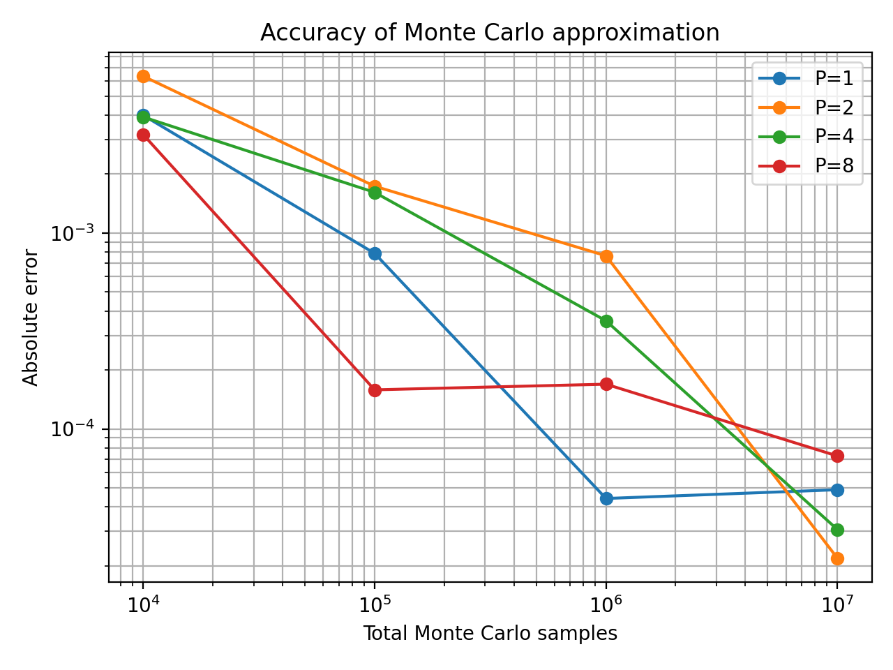
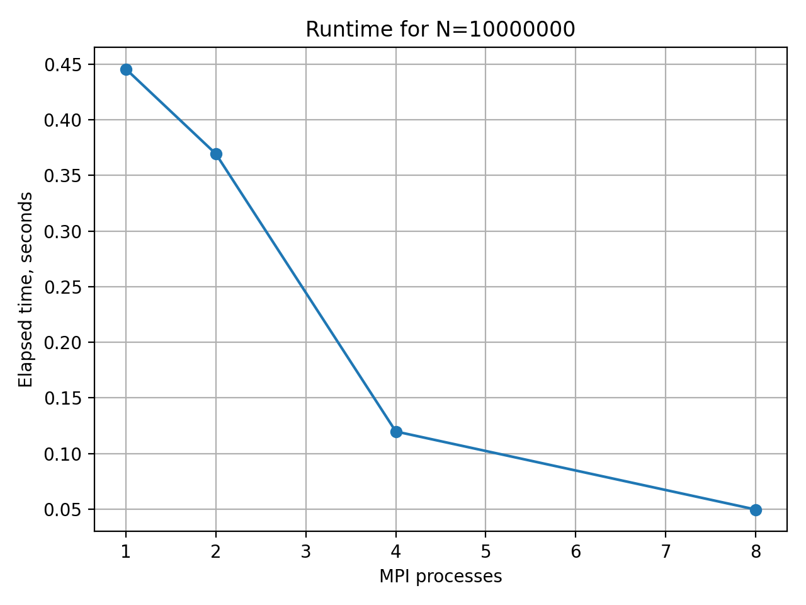
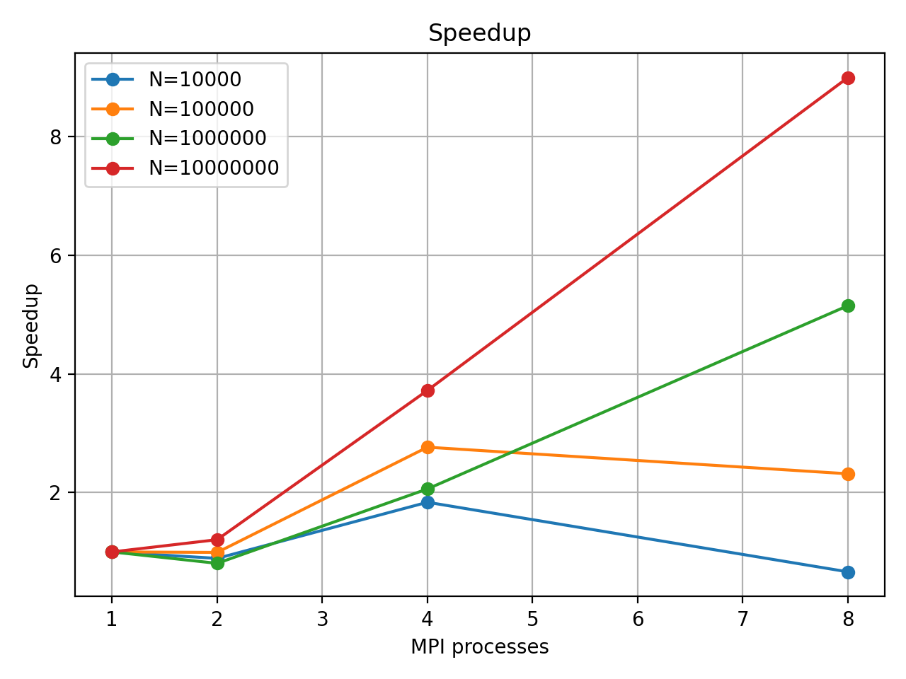
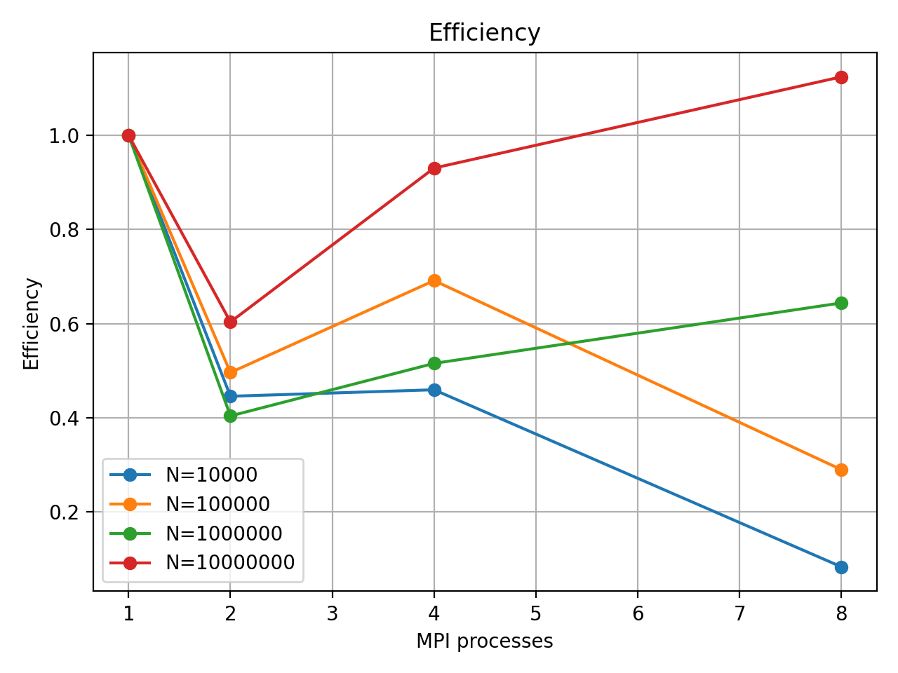

# Distributed Monte Carlo Approximation of ODE Definite Integrals via MPI

[](https://en.wikipedia.org/wiki/C_(programming_language))
[](https://www.open-mpi.org/)
[](LICENSE)


## Abstract

This project evaluates the distributed approximation of the definite integral representing the solution to the initial value problem:

$$
u'(x) = \sin(x), \quad u(0) = 0 \implies u(x) = \int_{0}^{x} \sin(t) \, dt = 1 - \cos(x)
$$

Using a **Monte Carlo** stochastic sampling approach, the computational workload is partitioned across multiple nodes in a distributed-memory system via **MPI**. The implementation leverages the **Master-Worker architecture**. Process 0 (Master) is responsible for determining problem parameters, dividing the total number of samples, sending tasks to Worker processes, receiving local results, and calculating the final approximation. Other processes (Workers) perform independent random sampling and return the local sum of values to the master process.

Finally, the accuracy of the method is compared against the exact solution, and the parallel efficiency is analyzed using execution time, **Speedup**, and **Efficiency** metrics.

## Mathematical Method: Monte Carlo Integration

To approximate the integral:

$$
I = \int_{0}^{x} f(t) \, dt
$$

we generate a random variable $$R$$ with a uniform distribution on the interval $$(0, 1]$$ and map the random point to $$t = xR$$.

By change of variables, the integral can be expressed as an expectation:

$$
\int_{0}^{x} f(t) \, dt = x \mathbb{E}[f(xR)]
$$

In this project, $$f(t) = \sin(t)$$. If $$N$$ independent random samples $$R_1, R_2, \dots, R_N$$ are generated, the Monte Carlo estimator is defined as:

$$
\hat{u}(x) = x \times \frac{1}{N} \sum_{i=1}^{N} \sin(xR_i)
$$

## Parallel Design: Master-Worker Model

The parallelization is performed using **MPI** based on the **Master-Worker pattern**. Let $$P$$ be the total number of MPI processes. Process rank 0 acts as the Master, and the remaining $$W = P - 1$$ processes are Workers.

### Workload Distribution
The total number of samples $$N$$ is divided as evenly as possible among the $$W$$ Workers. The base number of samples per worker is $$q = \lfloor N/W \rfloor$$, and the remainder $$r = N \bmod W$$ is distributed to the first $$r$$ workers. Therefore, the number of samples for worker $$k$$ is given by:

$$
N_k = 
\begin{cases} 
q + 1 & 1 \le k \le r \\
q & r < k \le W
\end{cases}
$$

This ensures a balanced workload distribution.

## Implementation Details

*   **Language & Library:** The program is written in **C** and utilizes the **MPI** library for inter-process communication.
*   **Random Number Generator:** To avoid identical pseudo-random sequences on different ranks, the **SplitMix64** generator is used. A unique seed is constructed for each rank based on its rank ID, ensuring independent random streams.
*   **Numerical Stability:** To reduce floating-point rounding errors during the summation of a large number of terms, the **Kahan summation algorithm** is used within each Worker process.
*   **Communication:** The Master sends the upper limit $$x$$ and control data (local sample count and seed) to each Worker using distinct MPI tags ($$TAG_X$$ and $$TAG_CONTROL$$). Workers return the local sum and their compute time using $$TAG_RESULT$$.
*   **Timing:** Execution time is measured using `MPI_Wtime`. The final reported parallel time is the maximum time among all processes (computed via `MPI_Reduce` with `MPI_MAX`), as it determines the overall runtime.

## Quick Start

### Prerequisites
*   MPI implementation (e.g., **OpenMPI** or **MPICH**)
*   C Compiler (`gcc` or `clang`)
*   Python 3 with `matplotlib` and `pandas` (for generating plots)

### Compilation and Execution

Compile the program using the `mpicc` wrapper:

```bash
mpicc -O3 -std=c11 -Wall -Wextra mc_integral_mpi.c -o mc_integral_mpi -lm
```

Run the program with 4 processes, evaluating at $$x = \pi/2$$ with $$10^7$$ samples and a seed of 12345:

```bash
mpiexec -n 4 ./mc_integral_mpi 1.5707963267948966 10000000 12345
```

**Generating Plots:**
After running experiments (e.g., using the provided `run_experiments.sh` script), generate the analysis plots:

```bash
python3 plot_results.py results.csv
```

The output plot files will be saved as:
- `accuracy.png`
- `runtime.png`
- `speedup.png`
- `efficiency.png`

## Experimental Results & Analysis

The program was tested with $$x = \pi/2$$, making the exact solution $$u(\pi/2) = 1 - \cos(\pi/2) = 1$$. Experiments were run for sample sizes $$N \in \{10^4, 10^5, 10^6, 10^7\}$$ and process counts $$P \in \{1, 2, 4, 8\}$$.

### 1. Numerical Accuracy (Monte Carlo Convergence)

<div align="center">
  
  <br>
  <em>Figure 1: Absolute error of the Monte Carlo approximation vs. Total samples.</em>
</div>

**Analysis:** 
According to Figure 1, the absolute error decreases as the total number of Monte Carlo samples increases from $$10^4$$ to $$10^7$$. This behavior is consistent with the theory of the Monte Carlo method, where the error of the mean estimate decreases with increasing sample size. The error roughly drops by an order of magnitude per decade increase in $$N$$ (theoretical rate of $$\mathcal{O}(N^{-1/2})$$). However, the decreasing trend is not perfectly uniform due to the stochastic nature of sampling. A specific execution with fewer samples might occasionally yield a smaller error than another execution with more samples due to randomness.

### 2. Execution Time (Runtime Scaling)

<div align="center">
  
  <br>
  <em>Figure 2: Execution time for N=10^7 versus number of MPI processes.</em>
</div>

**Analysis:**
Figure 2 demonstrates that for the largest sample size ($$N = 10^7$$), the execution time decreases significantly as the number of processes increases (from ~0.45 seconds for $$P=1$$ to ~0.05 seconds for $$P=8$$). This result is logical because the dominant portion of the runtime is spent calculating $$\sin(t)$$ values. By adding more processes, the local workload per Worker decreases, and computations are effectively divided, leading to a lower total time. For smaller problem sizes, this reduction is expected to be less noticeable because the overhead of MPI communication and process management outweighs the computation time.

### 3. Speedup Analysis

<div align="center">
  
  <br>
  <em>Figure 3: Speedup vs. Number of MPI processes for different sample sizes.</em>
</div>

**Analysis:**
In Figure 3, it is observed that for small sample sizes ($$10^4$$ and $$10^5$$), the speedup does not improve well with increasing processes; it remains approximately 1 or even slightly drops. This occurs because the total computation for $$N=10^4$$ is very small, and the time spent on MPI message passing, synchronization, and Master management forms a significant portion of the total runtime.

In contrast, for larger sample sizes ($$10^6$$ and $$10^7$$), significant speedup is achieved because the computation-to-communication ratio increases. Notably, for $$N=10^7$$ and $$P=8$$, the speedup value exceeds 8 (superlinear speedup). This behavior is attributed to cache effects, differences in execution paths between serial and parallel modes, or system scheduling fluctuations, and should not be interpreted as an absolute indication of ideal scaling without multiple trial runs.

### 4. Parallel Efficiency

<div align="center">
  
  <br>
  <em>Figure 4: Parallel Efficiency vs. Number of MPI processes.</em>
</div>

**Analysis:**
Figure 4 shows that for small sample sizes, efficiency drops as the number of processes increases (reaching as low as 10% for $$N=10^4$$ and $$P=8$$). This is expected because the cost of communication and synchronization is high relative to the small computational load. Processes spend significant time sending/receiving messages or waiting for other processes.

For larger sample sizes, efficiency improves significantly, indicating that the program utilizes parallel processes more effectively for larger problems. In the case of $$N=10^7$$, efficiency is measured at over 100%. Theoretically, ideal efficiency is 1 (100%). As explained in the speedup section, values greater than 1 can result from superlinear speedup factors such as cache effects or timing fluctuations.

## Communication Overhead and Scalability

In this implementation, communication is relatively simple. The Master sends 2 messages to each Worker (one for $$x$$, one for control data) and receives 1 message back (result and local time). Therefore, the total number of messages is $$3W$$. This is of order $$O(P)$$, and the data volume is very small. Consequently, for large sample sizes, the computational cost of the Monte Carlo loop dominates the communication cost.

However, for very small sample counts, even this minimal communication becomes significant compared to the compute time. This demonstrates a critical lesson in parallel computing: parallelization is not beneficial for all problem sizes, and the computation-to-communication ratio must be sufficiently large to justify distributed execution.

## License

Distributed under the MIT License. See `LICENSE` for details.
